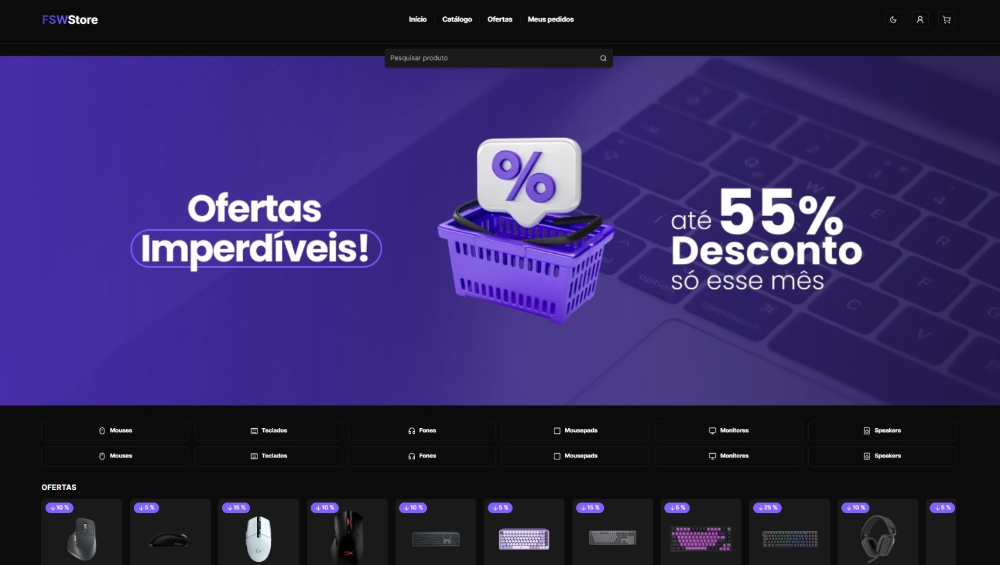
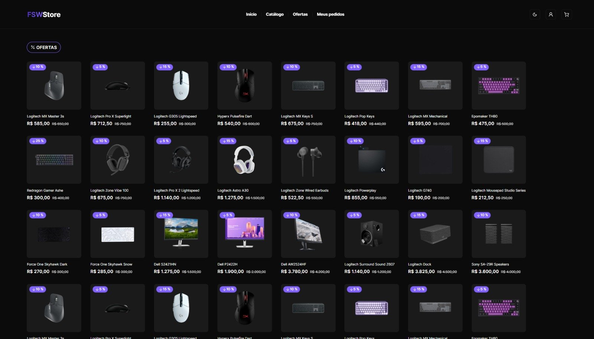
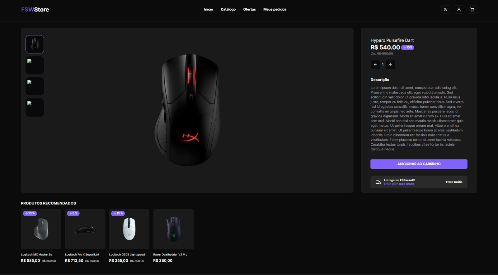
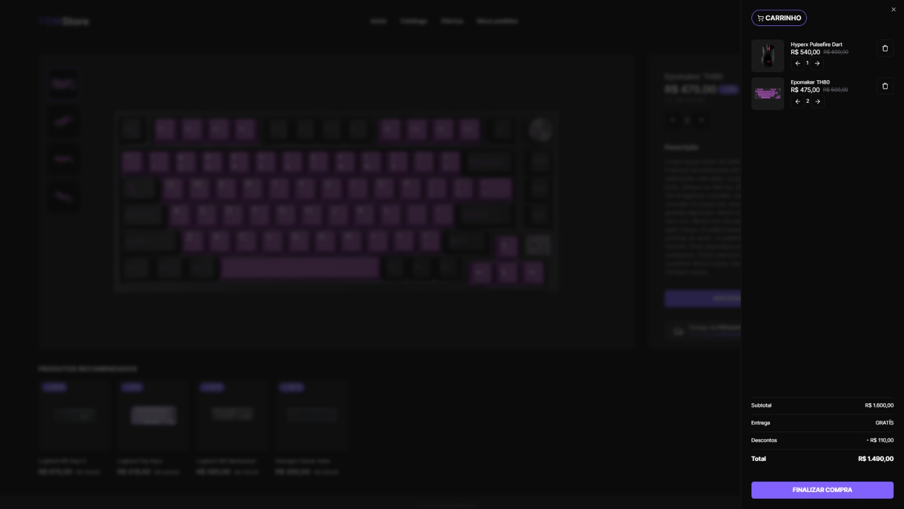
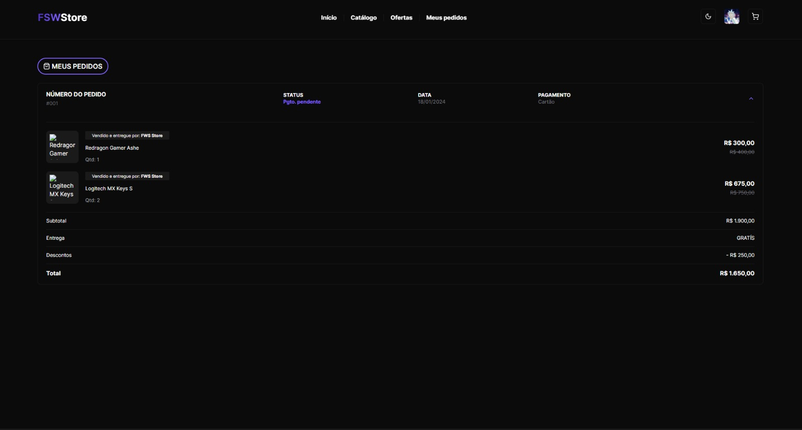
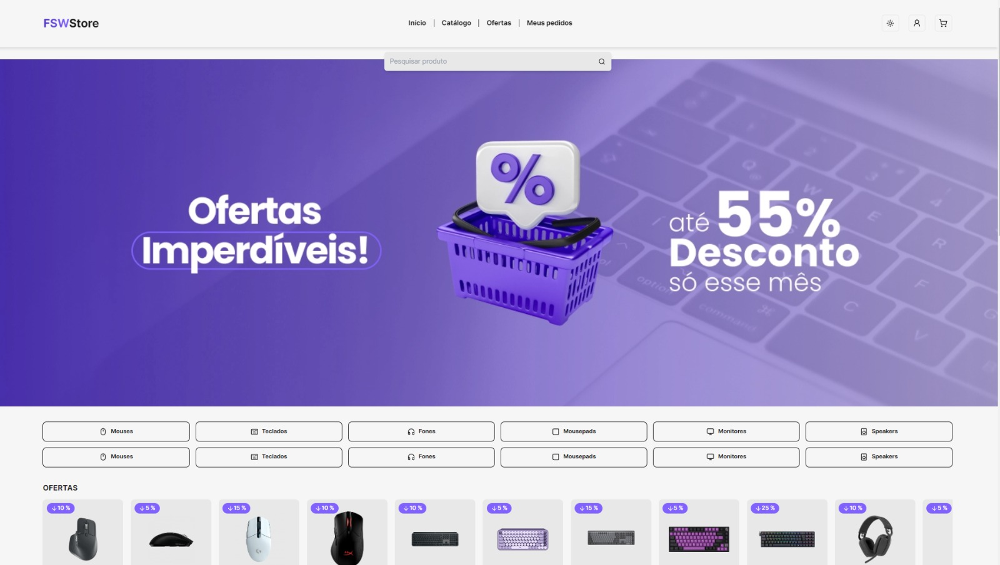
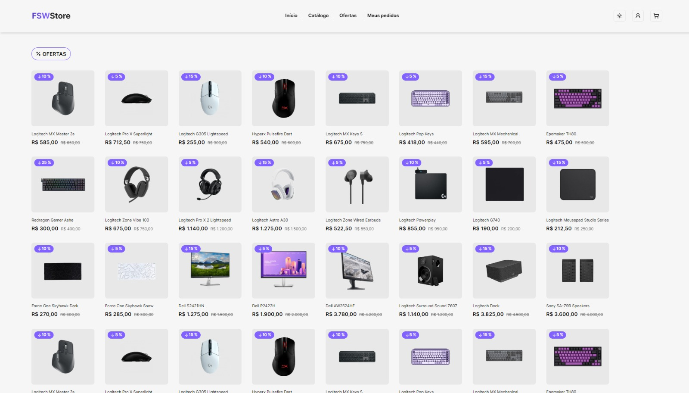
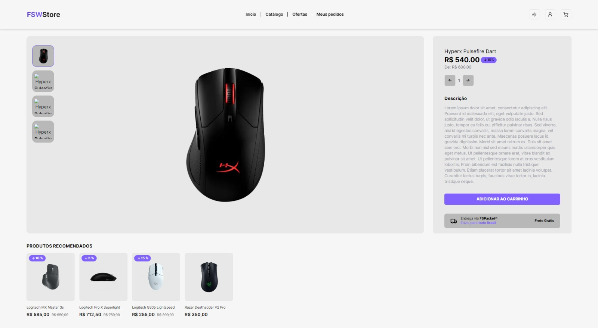
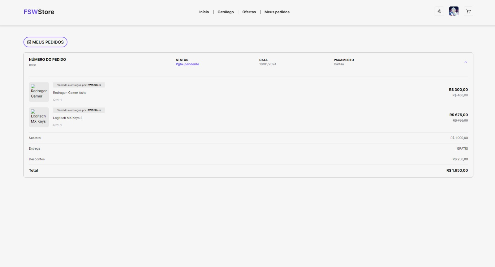

<h1 align='center'>FSW-Store</h1>

## Apresentação do Projeto

Bem-vindo ao FSW-Store! Uma aplicação em React.js de compras de periféricos.

## Aviso
* As imagens utilizadas no projeto ficou fora do ar.
* Para testar o checkout use o número de cartão "4242 4242 4242 4242" **(NÃO PASSE DADOS REAIS)**.
* Após realizar o checkout, os pedidos continua com o status de pagamento pendente, pois não há resposta de compra do stripe.

## Aprendizado

Ao decorrer do desenvolvimento do projeto, pude adquirir conhecimento em:

- **Integração com Banco de Dados:** Conexão com o banco de dados, para salvar informações de produtos, usuario, sessão, etc. 

- **Login com Google:** Fazer login com Google usando OAuth.

- **Integração com Stripe:** Aprendi a integrar a aplicação com o Stripe, permitindo que os usuários faça o checkout das compras.

- **Deploy da Aplicação:** Fiz o processo completo, desde o desenvolvimento até o deploy, garantindo que a aplicação estivesse pronta para uso em um ambiente de produção.

## ⚙ Tecnologias

## Ambiente de Deploy

## Preview do Projeto
### Dark mode

### Light mode

